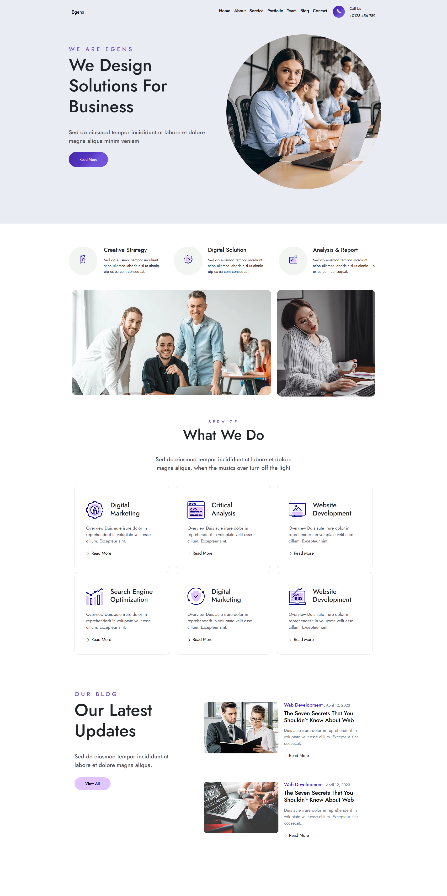

# Egens Bootstrap Landing Page ⭐🤩

This repository contains a Bootstrap landing page template called "Egens." It is designed to provide a sleek and modern landing page for various purposes such as product launches, portfolios, or business websites.


## Features

- Clean and professional design
- Fully responsive layout
- Built with Bootstrap for easy customization
- Includes sections for showcasing features, testimonials, pricing, and more
- Integration with Font Awesome for icons

## Live Demo

View a live demo of the Egens Bootstrap Landing Page [here](https://abdulrahim-ramadan.github.io/Egens-Bootstrap-Landing-Page/).

## Screenshots



## Usage

1. Clone the repository:

```bash
git clone https://github.com/abdulrahim-ramadan/Egens-Bootstrap-Landing-Page.git
```

2. Open `index.html` in your web browser to view the landing page template.

3. Customize the content and styles according to your needs. The template is built using Bootstrap, so familiarity with Bootstrap and basic HTML/CSS knowledge is recommended for customization.

## Contributing

Contributions are welcome! If you have any ideas, suggestions, or improvements, feel free to open an issue or create a pull request.

## License


This project is licensed under the [MIT License](LICENSE).


#Please ⭐ the repo to support our project
